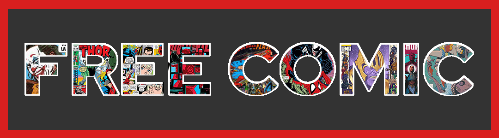

  
 

`FreeComic` is the easiest way to download PDF comics.

**Usage**
---

1. Download the `FreeComic` exe from Releases tab or Mega.
2. Go to readcomicsonline.ru
3. Look for any comic 
4. Copy the URL and paste in App
6. Press Download Button
7. Wait and you will se the PDF in desktop

**ENJOY**
---

+ Full PDF downloads without adds 
+ Infinite Downloads
+ The best Comic resolution u have never seen (A1 PDF Size )

**How to Contribute**
---

1. Clone repo and create a new branch: `$ git checkout https://github.com/VladiPrograma/FreeComic -b name_for_new_branch`.
2. Make changes and test
3. Submit Pull Request with comprehensive description of changes
